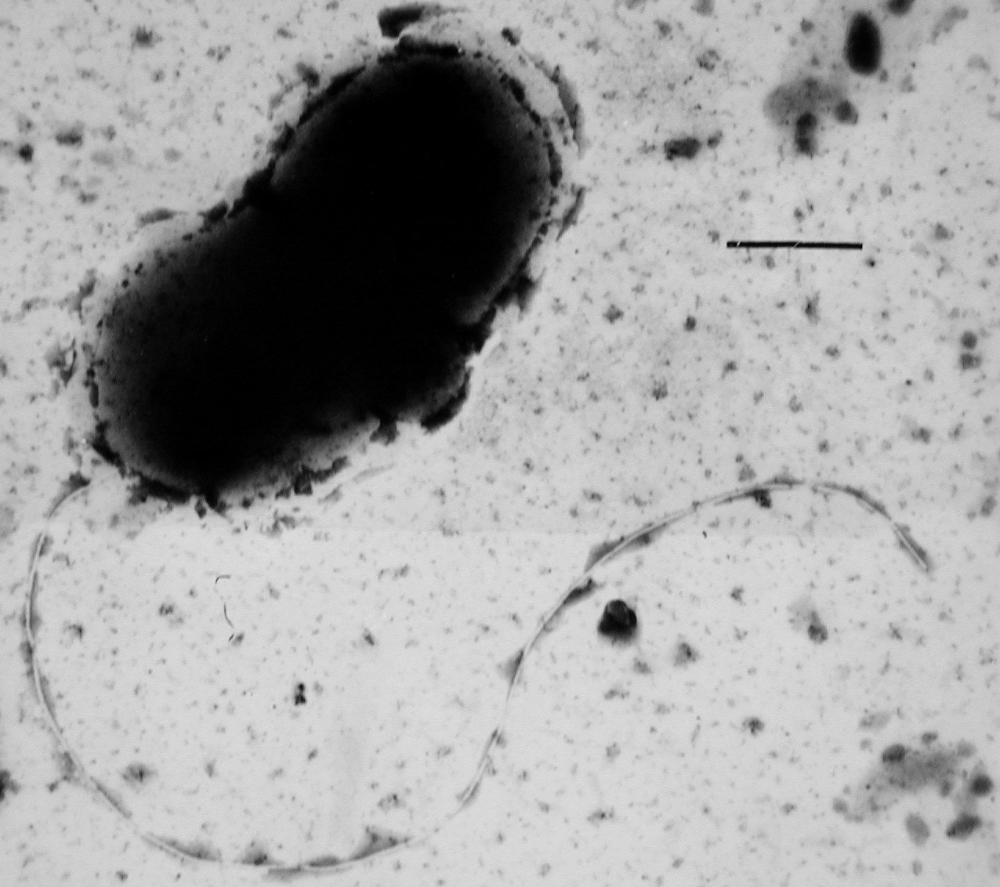

Py非专业玩家｜资深数据摸鱼工程师｜低频量化者｜曾任职BAT｜985水硕，现居北京

头像图片为[脱硫弧菌属](https://en.wikipedia.org/wiki/Desulfovibrio)中的一种细菌，可利用硫化物进行厌氧呼吸，神奇！

- twitter: [hanadumal](https://twitter.com/hanadumal)
- mail: <hanadumal@outlook.com>