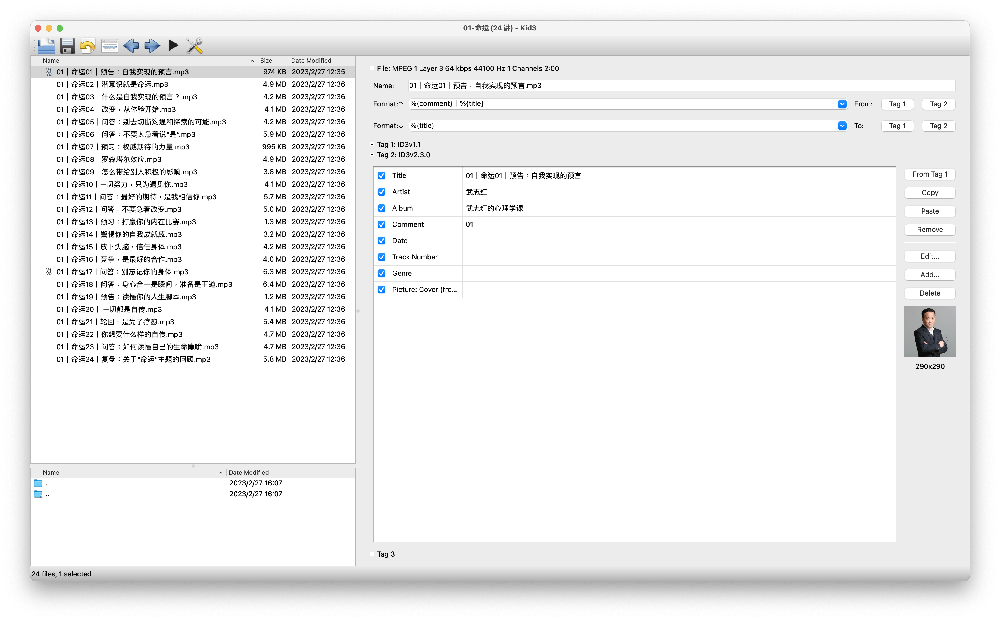
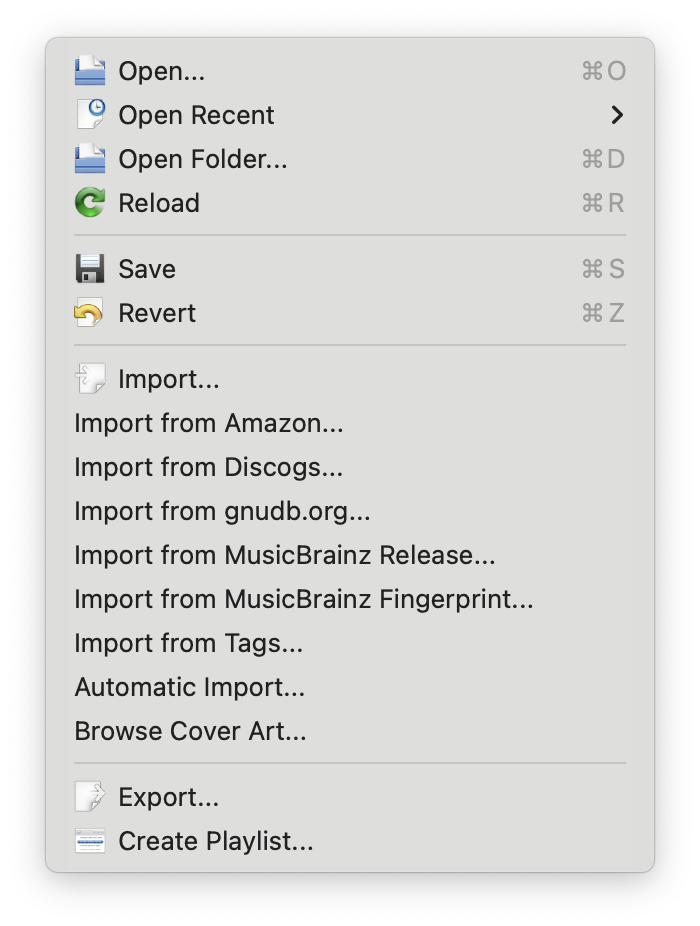
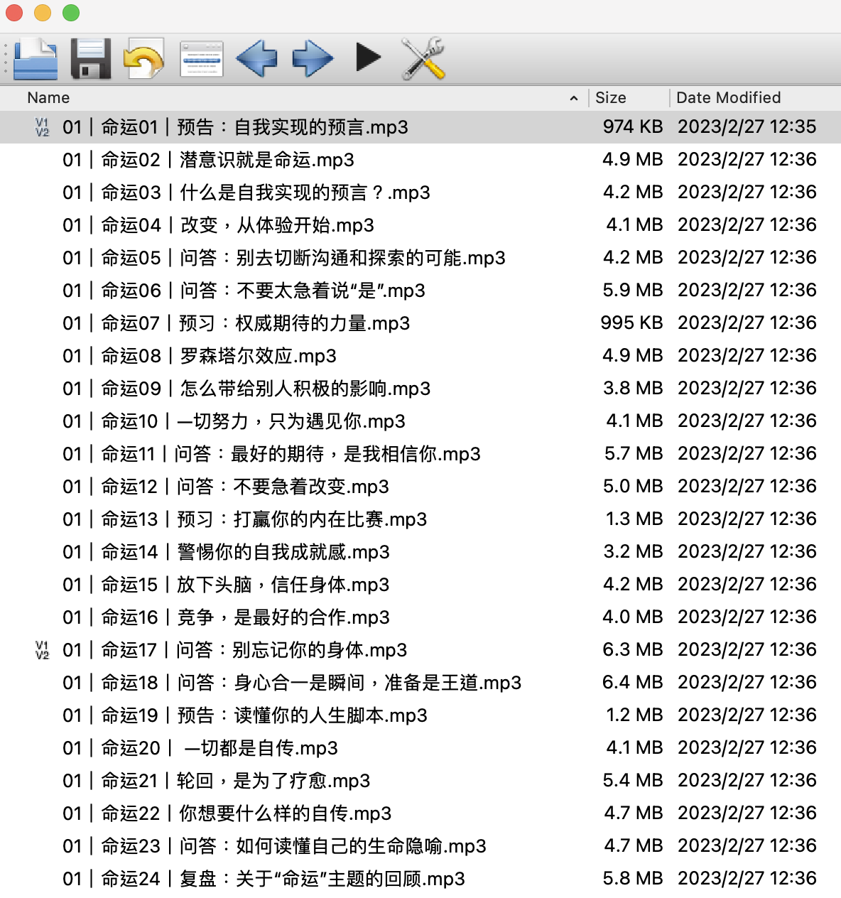
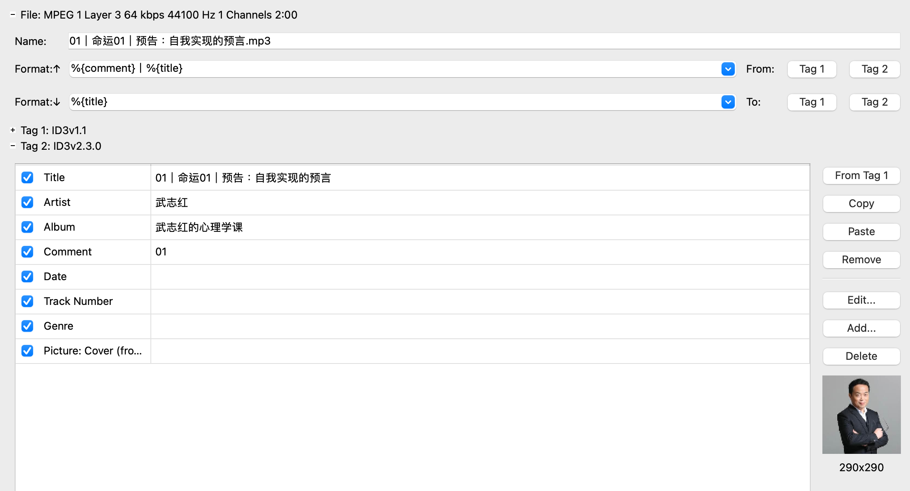
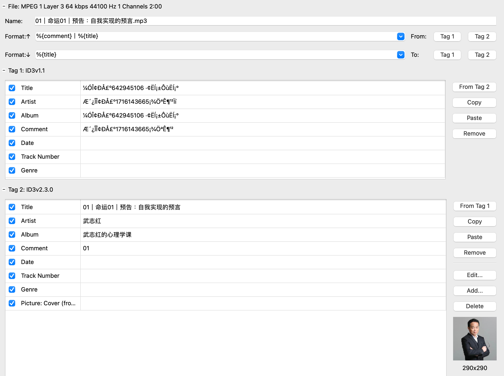
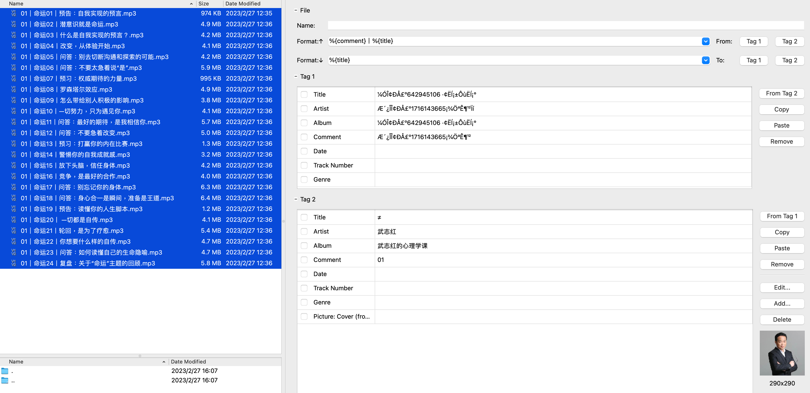

起因是我从网上下载了一套MP3的心理课程，在导入到Apple Music以后，发现Title、Auther、Album居然全是"添加微信XXXX，免费课程..."的广告，实在过于辣眼睛。遂网上冲浪查找开源的MP3元信息编辑工具。

Kid3官网: https://kid3.kde.org/

# Kid3简介

# Kid3特色功能
## 打开目录 ｜ Open Folder 
可以直接从弹出的文件选择菜单中选择目录，方便查看目录中内容，也为后续批量操作提供了基础。

选择完成后，可以在UI的左上侧看到目录下所有的文件。

## 编辑元信息 ｜ Edit Metadata
在UI的右侧可以看到MP3文件的各种信息，同时所有能看到的信息都是可编辑的。

| 标签         | 功能          |
| ------------ | ------------- |
| Name         | 文件名    |
| Title        | 元信息-的标题 |
| Artist       | 元信息-创作者 |
| Album        | 元信息-专辑   |
| Comment      | 元信息-注释   |
| Date         | 元信息-创作时间      |
| Track Number | 元信息-歌曲在专辑中的排序           |
| Genre        | 元信息-音乐类型              |
| Picture      | 元信息-封面   |

## 信息格式化 | Format Metadata 
在摸索一段时间后，发现格式化功能很强大，它有些类似编程语言中的string format。（请忽略乱码的Tag1)
- Format:↑ 代表用Tag中的已填充的内容，按照所填写的格式替换后，对Name进行赋值。截图中`%{comment} | %{title}` 先替换comment为"01"、title为"01|命运01｜预告：自我实现的预言"，最后拼接组成新的Name作为文件名。
- Format:↓ 正相反，将Name中的内容，按照所填写的格式化字符串进行拆分，并分别赋值给Tag中对应的字段。这里%{title}代表文件名整体赋给Tag中的Title。
- From: Tag1 Tag2 代表从哪个Tag版本中取值，点击后对应的进行替换Name
- To:   Tag1 Tag2 代表对哪个Tag版本中赋值，点击后对应的进行替换Tag中字段

## 批量修改 | Batch Edit
当在左侧的文件导航中选择多个文件后，可以做为整体对所有选中的文件进行编辑。可以看到Title由于文件名并不相同，所以会显示一个**≠**,Artist Album Comment是一样的，会显示出具体内容。

