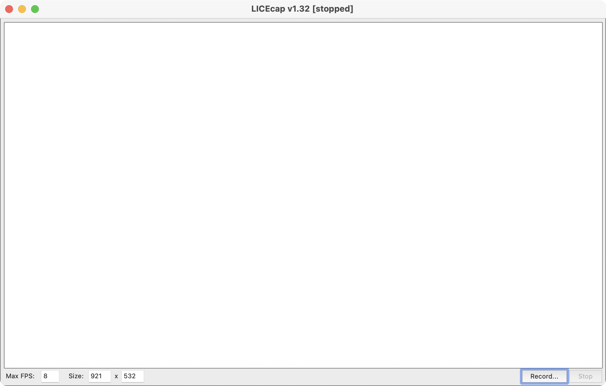

# LICEcap简介
官网: https://www.cockos.com/licecap/

LICEcap can capture an area of your desktop and save it directly to .GIF (for viewing in web browsers, etc) or .LCF (see below).

LICECAP用来捕捉屏幕的区域，并生成.gif或者.lcf。LCF是LICECAP自带的无损格式，压缩比高于gif,图像质量更好,时间戳(timestamping)更准确。

# LICEcap使用
主界面非常简洁，点击Record开始录制，点击Stop结束。
- 可以通过拖拽4个角来改变要截取的屏幕位置。
- 可以手动设置Max FPS(frames per second)，改变最大帧率。

