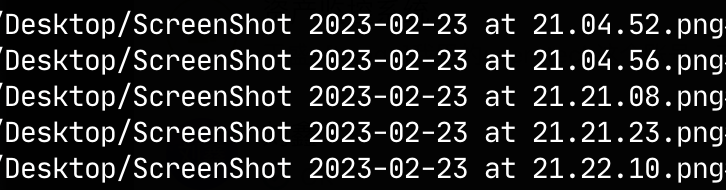
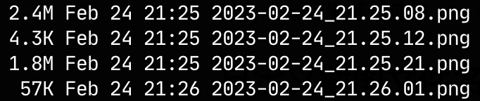

你有没有日常感觉使用 ⇧ + ⌘ + 4 截出的图片文件很膈应？其实可以动动手给它名字变得简单点。

## 自定义截图文件名
修改MacOS截图的名称，在文件名中增加时间，前缀设置为"ScreenShot"
```bash
# default is 1, in case of you had change it, set "include-date" 1 
defaults write com.apple.screencapture "include-date" 1 
# remove prefix from screenshot name 
defaults write com.apple.screencapture name "ScreenShot"
```

经过配置后，生成的截图文件名如下图。但文件名包含有"ScreenShot" "at"和多个空格，能不能只保留日期和时间呢？



- 经过实验，即使`defaults write com.apple.screencapture name "ScreenShot"` 把它改写为`defaults write com.apple.screencapture name ""`,你会发现截图文件开头仍然会带有一个" "
- 也没有官方的设置可以把" at "去掉，用自定义的时间格式字符串`%Y%M%H %H.%m.%s`来定制

## 自动截图改名服务

既然没有特别方便的办法对文件修改，参考[Launchd > 任务(Job)定义](./Launchd.md#任务(Job)定义)中的知识，可以在MacOS后台增加一个Agent服务，监听Desktop/（我的截图文件保存目录），一旦有新文件生成，对其重命名。让我们一步一步将其实现。

1. 简单的png截图重命名脚本，screencap_rename.sh

```sh
#!/bin/sh

mv ~/Desktop/ScreenShot*.png ~/Desktop/"`date "+%Y-%m-%d-%H.%M.%S"`.png"
```

2. 将上面的脚本放入/usr/loca/bin,并赋予可执行权限

```sh
chmod +x /usr/local/bin/screencap_rename.sh
```

3. 自定义一个launchd服务，监听~/Desktop/目录。将其保存到~/Library/LaunchAgents/usr.screenshot.rename.plist

```xml
<?xml version="1.0" encoding="UTF-8"?>
<!DOCTYPE plist PUBLIC "-//Apple//DTD PLIST 1.0//EN" "http://www.apple.com/DTDs/PropertyList-1.0.dtd">
<plist version="1.0">
<dict>
    <key>Label</key>
    <string>hana.screenshot.rename</string>
    
    <key>Program</key>
	<string>/usr/local/bin/screencap_rename.sh</string>
    
    <key>StandardOutPath</key>
    <string>/tmp/hana_screen_rename.out</string>
    <key>StandardErrorPath</key>
    <string>/tmp/hana_screen_rename.err</string>
    
    <key>WatchPaths</key>
    <array>
        <string>/Users/hana/Desktop</string>
    </array>
</dict>
</plist>
```
将其中的/Users/hana/Desktop，替换为你自己的截图保存目录。

4. 在优化一下吧，screencap_rename.sh每次只能处理一个文件。而且如果目录里有其他非截图的文件产生，也会调用这个脚本，但是此时Desktop/中可能并没有ScreenShot*.png会导致服务出错

因此引发一个尴尬的问题：**文件名含有空格，用`for xxx in `不好处理...**

好在shell中有IFS。通过使用`IFS（the Internal Field Separator）`，Shell依靠它去决定如何进行单词分隔。我们可以先把IFS换成\n,在脚本执行完后，再重置IFS，这样来处理遍历带空格的文件名。

```sh
#!/bin/sh

SAVEIFS=$IFS
IFS=$'\n'

for file_path in `ls $HOME/Desktop/ScreenShot*.png`
do
	old_path=${file_path}
    new_path=${file_path/ScreenShot /} # 将"ScreenShot "替换为""
    new_path=${new_path/ at /_}        # 将" at "替换为"_"
    mv ${old_path} ${new_path}
done

IFS=$SAVEIFS
```

5. 可能仍然会报错找不到路径，需要**Full Disk Access**了


怀疑是不是没有赋予全部访问权限的问题。确认了在把脚本和plist都修改成sh，并且赋给sh FULL Disk Access以后，问题解决。

又顺带学习shell中字符处理的方法。https://blog.csdn.net/dongwuming/article/details/50605911

## TLDR 最终直接看这里

先修改下screencapture的参数，保持默认不修改也行
```sh
# default is 1, in case of you had change it, set "include-date" 1 
defaults write com.apple.screencapture "include-date" 1 
# remove prefix from screenshot name 
defaults write com.apple.screencapture name "ScreenShot"
```

/usr/local/bin/screencap_rename.sh
```sh
#!/bin/sh

SAVEIFS=$IFS
IFS=$'\n'

for file_path in `ls $HOME/Desktop/ScreenShot*.png`
do
	old_path=${file_path}
    new_path=${file_path/ScreenShot /}
    new_path=${new_path/ at /_}
    mv ${old_path} ${new_path}
done

IFS=$SAVEIFS
```

~/Library/LaunchAgents/usr.screenshot.rename.plist
```xml
<?xml version="1.0" encoding="UTF-8"?>
<!DOCTYPE plist PUBLIC "-//Apple//DTD PLIST 1.0//EN" "http://www.apple.com/DTDs/PropertyList-1.0.dtd">
<plist version="1.0">
<dict>
    <key>Label</key>
    <string>hana.screenshot.rename</string>
    
    <key>Program</key>
	<string>/usr/local/bin/screencap_rename.sh</string>
    
    <key>StandardOutPath</key>
    <string>/tmp/hana_screen_rename.out</string>
    <key>StandardErrorPath</key>
    <string>/tmp/hana_screen_rename.err</string>
    
    <key>WatchPaths</key>
    <array>
	    <!--Change this path -->
        <string>/Users/hana/Desktop</string> 
    </array>
</dict>
</plist>

```

load the plist
```bash
launchctl load ~/Library/LaunchAgents/usr.screenshot.rename.plist
```

【Attention!】需要在Privacy&Security -> **Full Disk Access中打开sh的权限**。如果用的bash/zsh则替换为对应的。[Launchd > 常见问题](./Launchd.md#常见问题)

剩下就是去截图了，它们都会整整齐齐清爽的罗在目录里。


## 参考
[1]  [how to change the format of osx screenshot](https://apple.stackexchange.com/questions/251385/how-do-you-change-the-format-of-the-osx-screen-shot-file-name)


