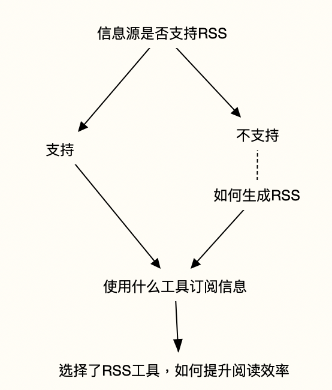
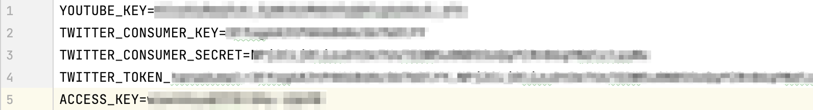
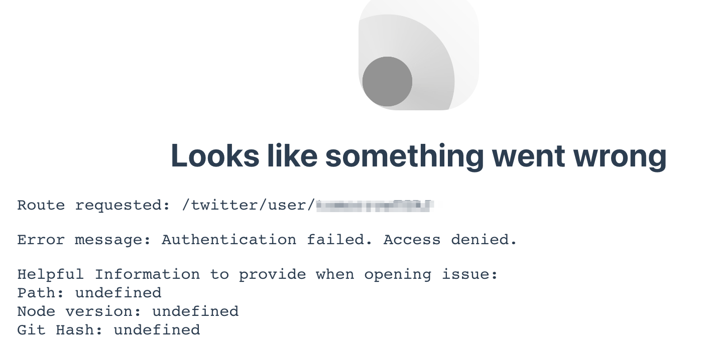

# 部署属于你自己的RSSHub
逃离信息过载，掌握信息摄入的主动权。

像头条、知乎、抖音、B站都依靠推荐算法，带来无尽的【你感兴趣的内容】，只要动手下滑，更多的类似信息总会继续呈现，永远没有尽头。沉浸其中不仅消耗了大量时间，沉浸其中也让我们的大脑超负荷成熟【信息过载】

2009年读大学的时候，室友MengYang就已经在使用Google Reader(次年这家伙还推荐过BTC)。为了解决过载的问题，又想到了RSS。

主动订阅比被动推送更高级、有效。我们摆脱算法的控制，自主选择要订阅的信息源，也可以及时对信息源进行调整，避免过载。



针对不支持RSS的网站/平台，借助RSSHub就可以轻松的制作RSS源。比如把B站某个UP主的视频更新，直接以RSS的形式推送给你；把twitter大V的发言自动抓取等。

```bash
git clone https://github.com/DIYgod/RSSHub.git
cd RSSHub
# npm ci --production 在我的环境报错，有兴趣可以深入解决
npm install 
```
更详细可参考 [RSSHub官方部署文档](https://docs.rsshub.app/install/#shou-dong-bu-shu-an-zhuang)

## 额外但必须的配置

在RSSHub的根目录下，创建.env配置文件。
我主要添加了Youtube、Twitter的配置。另外因为仅供自己使用，添加访问控制的AccessKey。


这样当访问中不带accessKey，会Access Denied，如下所示：


## 手动从后台启动

```
pm2 start lib/index.js --name rsshub
```

## systemd开机启动

```
vim /etc/systemd/system/rsshub.service
```

rsshub.service中的内容如下：

```
[Unit]  
Description=RSSHub  
After=network.target  
  
[Service]  
User=vincent  
Group=vincent  
Type=forking  
WorkingDirectory=/opt/RSSHub  
ExecStart=/usr/local/bin/start_rsshub.sh  
  
[Install]  
WantedBy=multi-user.target
```

因systemd只能使用特定的(参考systemd的信息)目录下的二进制文件，需要编写sh脚本如下,并cp到/usr/local/bin/下，注意`#!/bin/sh`不能省略，否则systemctl start会报文件格式错误。
```
#！/bin/sh  
cd /opt/RSSHub && /opt/node-v14.17.4-linux-x64/bin/pm2 start /opt/RSSHub/lib/index.js --name rsshub
```

之后就可以启动服务，并添加开机启动项目了：
```
systemctl daemon-reload
systemctl start rsshub
systemctl status rsshub

systemctl enable rsshub
```

## 添加自动更新

```
# pull RSSHub At 04:00 on Sunday  
0 4 * * 0  cd /opt/RSSHub && /usr/bin/git pull >> /opt/logs/pull_rsshub.log 2>&1
```